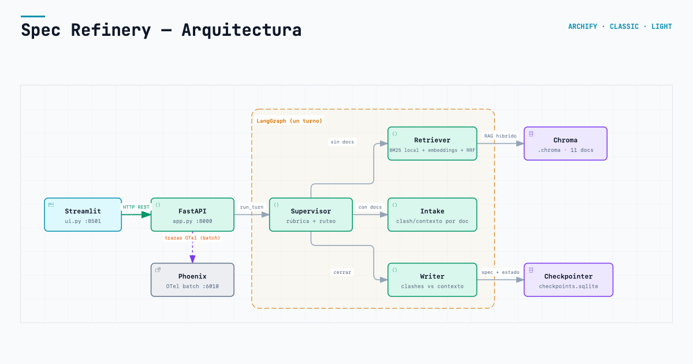

# Spec Refinery

Refinador de requerimientos para PMs: pegás un ticket vago y el sistema te **interroga** ronda a ronda hasta que la spec sea implementable. Busca las reglas de la empresa con RAG, discute cuando el pedido las contradice, y repregunta si le contestás cualquier cosa. No hay catálogo de preguntas: el LLM decide qué hace falta para este pedido, con un presupuesto visible de **3 preguntas por ronda** y **5 rondas** antes de congelar la spec. El humano cierra cuando quiere: con el botón o pidiéndoselo al chat.

Diagrama interactivo del grafo: [docs/grafo.html](docs/grafo.html) (generado con [Archify](.agents/skills/archify)).



En la UI, el panel derecho separa **Choques reales** (`clashes`) de **Contexto recuperado** (`context`), y el botón **Usar el ticket de demo** siempre arranca un hilo nuevo.

## Quick path (demo Cyber Monday)

1. Pegá el ticket: *“Para el Cyber Monday queremos un checkout más rápido, tipo Amazon: que el comprar ahora no pase por el carrito.”*
2. El interrogador cruza el pedido con el corpus. Antes de declarar una contradicción, interpreta los términos del pedido contra las definiciones recuperadas (glosario primero): «comprar ahora» sólo saltea la vista intermedia de carrito vacío, no el cierre de precio ni la reserva de stock. Si el glosario cubre el término y la contradicción se disuelve, **no hay choque real** — es un desenlace válido. Si la definición no alcanza, o el pedido igual saltea un paso obligatorio, el choque es real y te lo planta con el documento: sin carrito, ¿cuándo reserva stock `inventory-service` (`adr-stock-reserve.md`)? ¿Cómo confirma envío `shipping-service` (`adr-shipping-step.md`)?
3. Cada documento recuperado queda clasificado como **choque real** o **contexto**. Respondés en el chat: si contestás una evasiva, te la cita de vuelta y repregunta; la vaguedad no baja.
4. Cuando respondés en serio, la vaguedad baja y las preguntas cambian. Si te contradecís con tu propio ticket, te lo marca.
5. Si tu pedido choca con una regla y decidís cambiarla, queda anotado en **Decisiones** y deja de preguntártelo. Las reglas son evidencia, no ley.
6. Cerrás vos: apretás **Cerrar spec** o se lo pedís al chat — nunca se niega. Si se agotan las 5 rondas, la spec se congela sola. Una vez cerrada **no se reabre** (el flag `closed` es pegajoso) y el control de cierre desaparece de la UI. En los dos casos el estado dice qué quedó abierto.

## Levantar

```bash
python -m venv .venv
source .venv/bin/activate
pip install -r requirements.txt
./run.sh
```

- API FastAPI: http://127.0.0.1:8000 (Swagger en `/docs`)
- UI Streamlit: http://127.0.0.1:8501
- Phoenix (trazas): http://127.0.0.1:6010
- `run.sh` corre `ingest.py` si falta `.chroma`, arranca Phoenix best-effort con Docker (si no hay Docker, avisa y sigue), levanta la API en background y deja Streamlit en primer plano. El tracing está **encendido por defecto** (sin variables de entorno) siempre que estén instalados los paquetes de Phoenix — ver [Trazas con Phoenix](#trazas-con-phoenix).

QA sin credenciales LLM (grafo dummy + Phoenix):

```bash
docker compose up --build
```

- API: http://127.0.0.1:8000/health
- UI: http://127.0.0.1:8501
- Phoenix: http://127.0.0.1:6010
- `docker compose` levanta Phoenix + api + ui, pero el servicio `api` corre con `SPEC_REFINERY_GRAPH=fake`: preguntas canned con nodos dummy, **sin LLM ni embeddings**, para ejercitar el contrato de la API sin credenciales. Para Vertex/OpenRouter: `SPEC_REFINERY_GRAPH=live` y un `.env` con las keys.

Variables útiles:

| Variable | Default | Uso |
|----------|---------|-----|
| `SPEC_REFINERY_API` | `http://127.0.0.1:8000` | URL de la API para Streamlit |
| `LLM_PROVIDER` | `gemini` | `gemini` (Vertex/ADC) u `openrouter` |
| `SUPERVISOR_MODEL` | default del proveedor | Modelo del supervisor (`openrouter` o override por rol) |
| `INTERROGATOR_MODEL` | default del proveedor | Modelo del interrogador (`openrouter` o override por rol) |
| `WRITER_MODEL` | default del proveedor | Modelo del writer (`openrouter` o override por rol) |
| `VECTOR_BACKEND` | `chroma` | `chroma` local (único backend soportado) |
| `PHOENIX_COLLECTOR_ENDPOINT` | `http://localhost:6010/v1/traces` | Endpoint OTLP de Phoenix. En compose se override a `http://phoenix:6006/v1/traces`. |

## Grafo (un turno)

```
mensaje del PM
    → supervisor
         ├─ no hay docs de este turno        → retriever → supervisor
         ├─ hay docs, no interrogó todavía   → intake    → supervisor
         └─ ya interrogó, o el PM dijo cerrar → writer   → fin del turno
```

Cada nodo corre **como mucho una vez por turno**: volver a interrogar sobre el mismo transcript lo único que hace es loopear el grafo.

| Nodo | Rol |
|------|-----|
| **Supervisor** | Rutea según rúbrica dura; no busca ni escribe. |
| **Retriever** | RAG híbrido (BM25 + embeddings + RRF) sobre Chroma. El BM25 es local (`rank_bm25`, `LocalBM25Retriever`): `langchain-community` ya no es dependencia. |
| **Intake** (interrogador) | LLM: lee el ticket, todo el transcript y las reglas recuperadas. Interpreta el pedido contra las definiciones recuperadas (glosario primero) antes de declarar una contradicción, y decide qué preguntar (hasta 3 por ronda, 5 rondas) y si la spec ya se puede cerrar. Declara CADA documento recuperado como `clash` o `context` en `classifications` (un `DocumentAssessment` por documento: `document_id` + `kind`). Sin catálogo de preguntas ni scoring por palabras clave. |
| **Writer** | Reescribe `understanding`, `criteria` y `services`, y deriva `clashes` y `context` de las declaraciones del interrogador: `clashes` son los choques reales, se acumulan en el hilo, se deduplican por `document_id` y sobreviven al cierre; `context` es lo recuperado en el turno (se arrastra el anterior si el turno no trajo nada). No puntúa: el veredicto (`status`) es del interrogador. Deja `closed` en la spec. |

La API (`app.py`) es el sistema; Streamlit (`ui.py`) es la piel.

## API

| Acción | Endpoint |
|--------|----------|
| Empezar | `POST /threads` → `{ticket}` → `thread_id` + spec |
| Seguir | `POST /threads/{id}/messages` → `{content}` → spec |
| Cerrar | `POST /threads/{id}/close` → spec final |

`/messages` también cierra si el humano lo pide en texto (*“cerrá la spec”*, *“dala por cerrada”*).
Lo decide el interrogador leyendo la intención, no un regex: describir el dominio
(*“el precio se sigue cerrando en el carrito”*) no cierra nada.

El cierre es pegajoso: cuando la spec queda `closed`, el hilo no se reabre en
turnos siguientes y la UI deja de mostrar el control de cierre.

## Trazas con Phoenix

El tracing está **encendido por defecto**: `app.py` llama a `setup_tracing()` al importar. Si los paquetes están instalados, instrumenta LangChain/LangGraph y exporta cada corrida a Phoenix con un `BatchSpanProcessor`, proyecto `spec-refinery`. No hace falta setear ninguna variable.

- Endpoint por defecto (host): `http://localhost:6010/v1/traces` — el `:6010` es donde `run.sh` publica Phoenix.
- Override: `PHOENIX_COLLECTOR_ENDPOINT`. En `docker compose` vale `http://phoenix:6006/v1/traces` (la red interna del compose).
- Dependencias: `requirements-compose.txt` (imagen Docker) incluye `arize-phoenix` y `openinference-instrumentation-langchain`; `requirements.txt` (instalación local) **no** las trae, así que en local `setup_tracing()` queda no-op hasta que las instales: `pip install arize-phoenix openinference-instrumentation-langchain`. Sin ellas la app arranca igual, sólo que sin trazas.

Phoenix **no** va embebido en Streamlit. Para observar corridas con modelo real:

```bash
./run.sh          # arranca Phoenix + API + UI (trazas si los paquetes están instalados)
```

Con un `phoenix serve` standalone (UI en `:6006`) apuntá el endpoint ahí:

```bash
pip install arize-phoenix openinference-instrumentation-langchain
phoenix serve     # UI en http://localhost:6006
export PHOENIX_COLLECTOR_ENDPOINT=http://127.0.0.1:6006/v1/traces
./run.sh
```

Corré el quick path (ticket Cyber Monday → responder → cerrar) y filtrá por `spec-refinery` en la UI; exportá las trazas desde el menú **Export**.

Alternativa: [LangSmith](https://smith.langchain.com/) con `LANGCHAIN_TRACING_V2=true` y `LANGCHAIN_API_KEY`.

## Diagramas

Para regenerar el HTML del grafo:

```bash
node .agents/skills/archify/bin/archify.mjs deliver architecture \
  docs/spec-refinery.architecture.json docs/grafo.html --quality showcase
```

Diagramas: usar Archify del repo (`.agents/skills/archify`). La imagen estática que se ve arriba es `docs/spec-refinery-arquitectura-share-card.png`, exportada del mismo artefacto.

## Tests

```bash
.venv/bin/pytest tests/ -v
```

La suite actual: **106 passed, 0 warnings**. Los tests de API y de `qa_system`
manejan la app con `httpx.ASGITransport` (no `fastapi.testclient`), y
`qa_system.py` es async (corre con `asyncio.run`).

## System evidence tests

`qa_system.py` runs 6 end-to-end scenarios against the live API and verifies
that each one produced traces in Arize Phoenix (rubric evidence: 5+ system
tests with traces visible in Phoenix or LangSmith).

```bash
docker compose up -d          # or: ./run.sh (API on :8000)
.venv/bin/python qa_system.py --base-url http://127.0.0.1:8000 --phoenix-url http://localhost:6010
```

What it proves:

- **S1** `GET /health` + `POST /threads` → 200 with a valid Pydantic response.
- **S2** Golden question #1 (from `golden_set.json`) in a new thread → 200 and
   retrieved evidence (`spec.clashes` reales y/o `spec.context`) with
  `document_id`.
- **S3** Golden question #2 in a **different** new thread → same retrieval path.
- **S4** Follow-up message on the **same** thread → 200 with `spec.request`
  unchanged → the checkpointer kept state (multi-turn continuity).
- **S5** Malformed payload (`POST /threads` without `ticket`) → 422 with a
  Pydantic error detail.
- **S6** (bonus) `POST /threads/{id}/close` → 200; the spec reflects closure.

Trace verification: after the scenarios, the script queries Phoenix
(`QA_PHOENIX_URL`, default `http://localhost:6010` — the compose mapping) for
spans inside each scenario's execution window and prints per-scenario span
counts/names. It exits 0 only if all 5 mandatory scenarios pass **and** the
trace check passes. Fallbacks (never fabricated as a pass): Phoenix
unreachable or missing → `SKIP`; LangSmith tracing active
(`LANGCHAIN_TRACING_V2`/`LANGSMITH_TRACING`) → Phoenix check `N/A`, traces
land in LangSmith. CLI real (`python qa_system.py --help`): `--base-url`
(API, o `QA_BASE_URL`), `--phoenix-url` (Phoenix, o `QA_PHOENIX_URL`; standalone
`phoenix serve` usa `:6006`), `--trace-wait` (segundos a esperar spans, default
60), `--skip-traces` (escenarios sin chequeo de trazas) y `--selftest` (corre
todo in-process contra el grafo fake, sin servidor ni credenciales).


Sin modelo en CI; golden set y API con grafo dummy.
